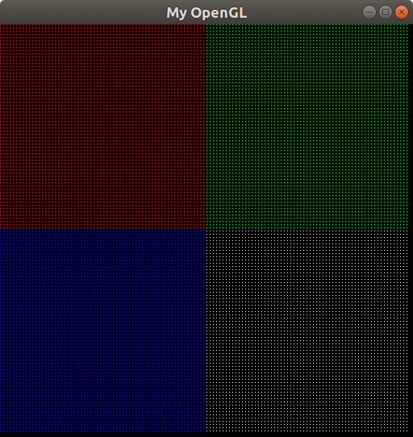
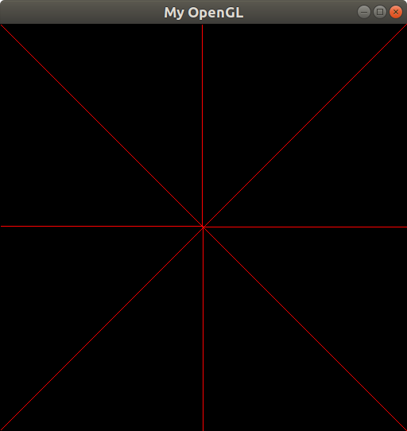
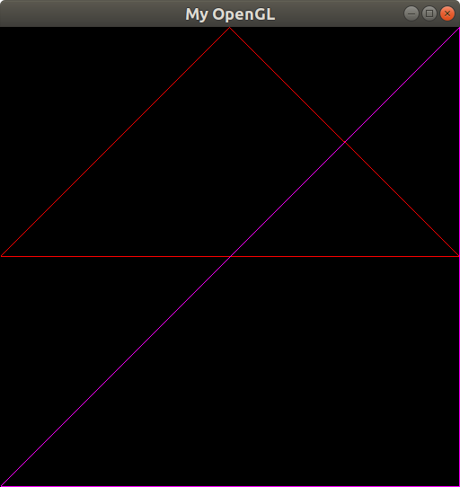

# computergraphics
Repository that stores all of my Computer Graphics' class assignments. I am currently attending to this class at the Federal University of Paraíba (UFPB) with the PhD Christian Pagot.

# Rasterizing

What does it mean? So, basically, rasterizing is the technique used to draw stuff on computer screens. But how do we ~magically~ draw stuff on a computer screen? Well, the computer has a memory, where we can store info about which pixels should be turned on/off and we can define its colors. Formally speaking, Foley defined rasterizing as:

> Approximation of mathematical primitives, described in terms of vertices on a Cartesian grid, by sets of pixels of the appropriate intensity of gray or color.

We have a memory full of info about our pixels, but how does the video card **really** gets that info stored on memory and knows which pixels should be turned on or off? Imagine our memory video working as a giant array. For this example, I will consider a screen that has 512 pixels through its x-axis or w (width) and 512 pixels through its y-axis or h (height). If I want to turn on a red pixel in the center of the screen, I should specify its coordinates as (255,255) and its color as (255,0,0,255). You'll have to keep in mind that the (0,0) starts on the superior leftmost point of your screen. 

## Pixels

The following function is able to draw pixels on a computer screen:

```
void PutPixel(int x, int y, int red, int green, int blue, int alpha){
    
    FBptr[4*x + 4*y*IMAGE_WIDTH + 0] = red;
    FBptr[4*x + 4*y*IMAGE_WIDTH + 1] = green;
    FBptr[4*x + 4*y*IMAGE_WIDTH + 2] = blue;
    FBptr[4*x + 4*y*IMAGE_WIDTH + 3] = alpha;
       
}
```

<p align="center">
	<br>
	
	<h5 align="center">Figure 1 - Result of PutPixel()</h5>
	<br>
</p>

## Lines

In order to draw lines, Bresenham's algorithm should be used to complete this task. Its main advantage, compared to DDA (Differential Digital Analyzer), is that we handle integer values and the operations involved are SUM and SUB, instructions which are not considered expensive to Assembly. 

This algorithm is used to decide which pixels should be turned on in order to result on a line. Imagine that you have drawn the first pixel of your line. You have to turn on the next pixel, but should it be the one in the east (E) or the one in the northeast (NE)? If the decision variable, denoted as "delta" on my implementation, is greater than zero, we should turn on the pixel in the NE. Else, E. If delta equals zero, then you should choose whichever you prefer.

<p align="center">
	<br>
	
	<h5 align="center">Figure 2 - Result of DrawLine()</h5>
	<br>
</p>

Now, let's take a look at the first quadrant that involves angles between 0 and 90 degrees:

```
if(dx >= 0 && dy >= 0){
        
        /*First octet*/
        if(abs(dx) > abs(dy)){
           delta = 2*dy - dx;
           east = 2*dy;
           northeast = 2*(dy-dx); 

           while(x < x1){    
               if(delta <= 0){
                   delta += east;
                   x++;
               } else {
                   delta += northeast;
                   x++;
                   y++;
               }
               PutPixel(x, y, red, green, blue, alpha);
           }

        } 
        /* Second octet */
        else {
            delta = dy - 2*dx;
            east = 2*(dy-dx);
            northeast = -2*dx;

            while(abs(y) < abs(y1)){
                if(delta <= 0){
                    delta += east;
                    x++;
                    y++;
                } else {
                    delta += northeast;
                    y++;
                }

                PutPixel(x, y, red, green, blue, alpha);
            }
        }
    }

```

You should be able to realize that if delta equals or is lower than zero, the chosen pixel should be the one located in the NE. Else, E. You should be careful with the location of the E and NE of each octet. I messed up with it a lot until I finally figured things out. After you complete the first four octets, the other ones should be seen as mirrors, but you have to pay attention to the fact that for the fifth and sixth octets, x0 becomes y1, y0 becomes x1, x1 becomes y0 and y1 becomes y0. The seventh and eighth octets should handle the following particularities: x0 becomes x1, y0 becomes y1, x1 becomes x0 and y1 becomes y0. Knowing this, the function DrawLine() can be called recursively.  

## Triangles

So, what is a triangle? A triangle is a plane figure with three straight sides and three angles. We can interpret those sides as lines. Inside the DrawTriangle function, you can see that we should call DrawLine() three times, for each line to be drawn. I have drawn two triangles, red and fuchsia ones, in order to demonstrante its operation.

<p align="center">
	<br>
	
	<h5 align="center">Figure 3 - Result of DrawTriangle()</h5>
	<br>
</p>

# Conclusion

This work resulted on learning about what is a rasterizing technique as well as how Bresenham's algorithm is used in order to draw lines on a computer screen. Some concepts about how the video memory works were learned. The main difficulty of this work was to understand how to implement Linear Interpolation in order to obtain the colors of the pixels that compose the lines. Besides that, a first contact with the framework was interesting and the three functions required in the specification of the project were completed.
As a future work, the Linear Interpolation has to be understood in order to implement it correctly.

# References
<p>http://www.codebind.com/linux-tutorials/install-opengl-ubuntu-linux/</p>
<p>https://jansebp.wordpress.com/2012/12/16/icg-t1-rasterizacao/</p>
<p>https://github.com/ThiagoLuizNunes/CG-Assignments/tree/master/cg_framework</p>
<p>https://en.wikipedia.org/wiki/Bresenham%27s_line_algorithm</p>
<p>https://github.com/adam-p/markdown-here/wiki/Markdown-Cheatsheet#code</p>
